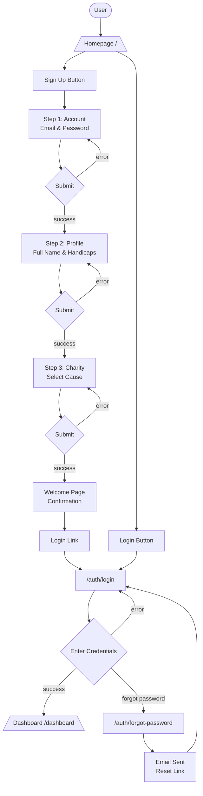
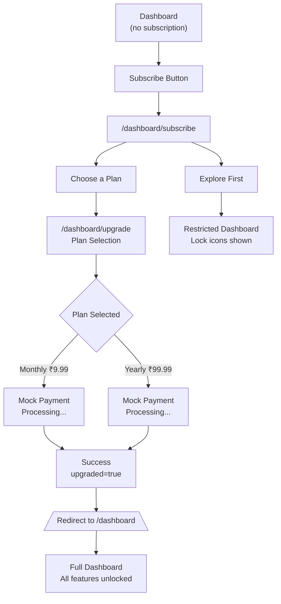
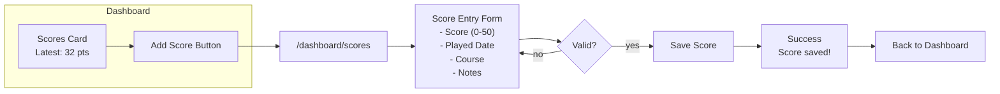
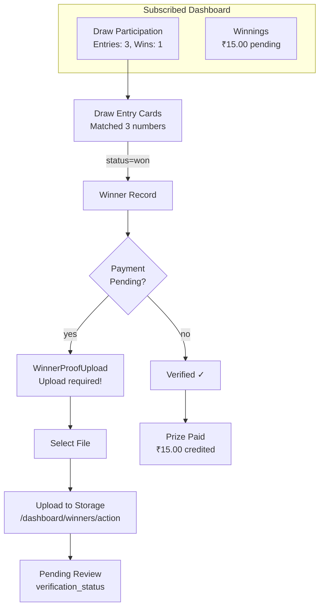
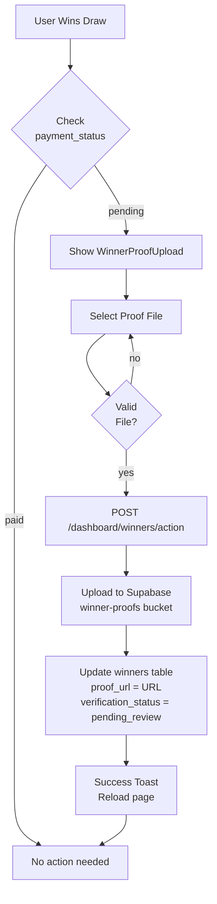
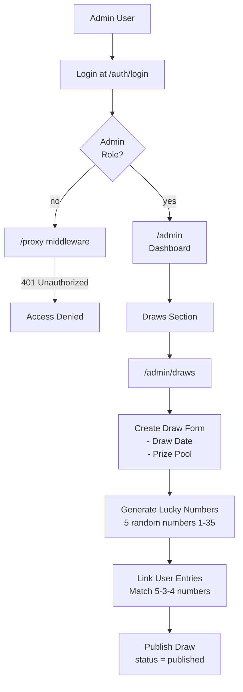
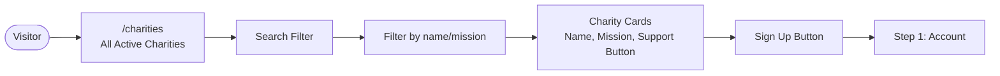

# Golf Charity Platform Flow (v2)

## User Flows

### Authentication Flow

### Subscription Flow

### Score Management Flow

### Draw & Winnings Flow

### Winner Proof Upload Flow

### Admin Flow

### Public Pages Flow

## Page Routes

| Route | Purpose | Auth Required |
|-------|---------|---------------|
| `/` | Homepage | No |
| `/auth/signup` | 3-step signup | No |
| `/auth/login` | Login | No |
| `/auth/forgot-password` | Password reset | No |
| `/charities` | Public charity listing | No |
| `/dashboard` | User dashboard | Yes |
| `/dashboard/subscribe` | Subscribe options | Yes |
| `/dashboard/upgrade` | Plan selection | Yes (subscribed) |
| `/dashboard/scores` | Score management | Yes (subscribed) |
| `/dashboard/winners/action` | Proof upload API | Yes |
| `/admin` | Admin dashboard | Yes (admin) |
| `/admin/draws` | Draw management | Yes (admin) |

## API Routes (Route Handlers)

| Route | Method | Purpose |
|-------|--------|---------|
| `/auth/signup/action` | POST | Create account (step 1) |
| `/auth/callback` | GET | OAuth callback |
| `/dashboard/upgrade/action` | POST | Create subscription |
| `/dashboard/winners/action` | POST | Upload winner proof |

## Database Tables

- `profiles` - User profiles with charity selection
- `subscriptions` - Active subscriptions
- `scores` - User golf scores
- `charities` - Partner charities
- `draws` - Monthly draws
- `draw_entries` - User entries in draws
- `winners` - Winning records with proof_url
