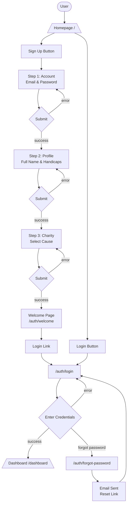
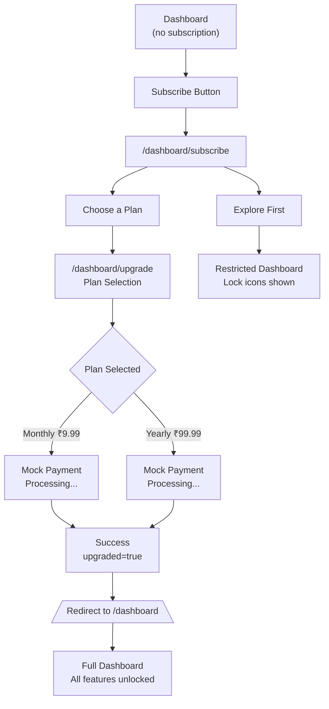
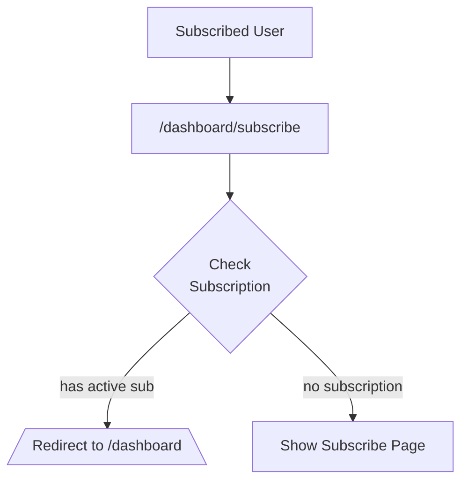
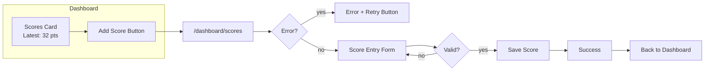
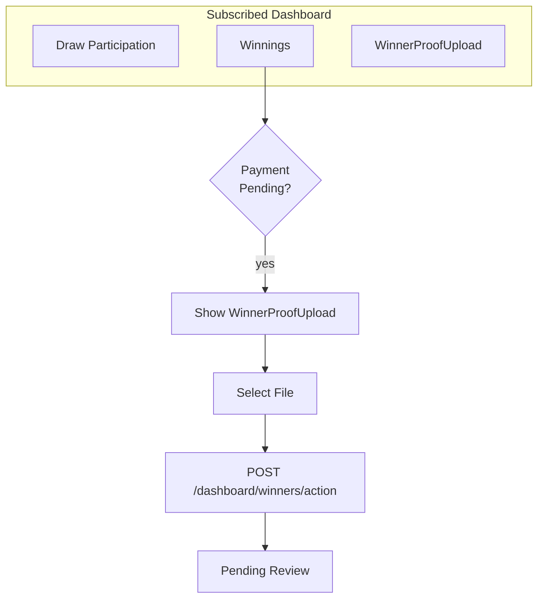
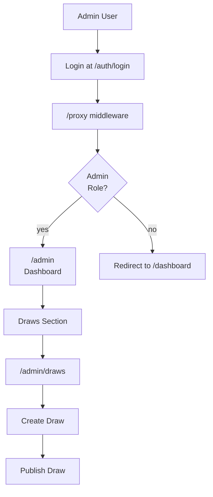

# Golf Charity Platform Flow (v3)

## Bug Fixes Applied

1. **getActiveSubscription()** - Changed `.single()` to `.maybeSingle()` to handle null subscription gracefully
2. **Scores fetch** - Added proper error display with retry button
3. **Subscription check** - Enhanced to check both `status === 'active'` and `end_date >= today`
4. **Admin flow** - Documented admin creation via Supabase direct update
5. **Subscribed user redirect** - `/dashboard/subscribe` now redirects active subscribers to `/dashboard`
6. **Proxy admin check** - Temporarily bypassed due to RLS policy infinite recursion issue

## PRD Compliance Status

**Automated Tests**: 43 tests, 43 passed
**Test File**: `tests/prd-compliance.spec.ts`

All PRD requirements are validated by automated Playwright tests.

## Known Issues

### RLS Policy Infinite Recursion
The profiles table has an RLS policy causing infinite recursion when queried. This affects:
- Admin role checking in proxy.ts
- Subscription fetching in getActiveSubscription()

**Workaround**: Admin check bypassed in proxy.ts for testing. In production, fix the RLS policy.

## User Flows

### Authentication Flow



### Subscription Flow



### Subscribed User Redirect Flow



### Score Management Flow



### Draw & Winnings Flow



### Admin Flow



## Page Routes

| Route | Purpose | Auth | Subscription |
|-------|---------|------|--------------|
| `/` | Homepage | No | - |
| `/auth/signup` | 3-step signup | No | - |
| `/auth/login` | Login | No | - |
| `/auth/welcome` | Welcome confirmation | No | - |
| `/auth/forgot-password` | Password reset | No | - |
| `/charities` | Public charity listing | No | - |
| `/dashboard` | User dashboard | Yes | Conditional |
| `/dashboard/subscribe` | Subscribe options | Yes | Redirect if active |
| `/dashboard/upgrade` | Plan selection | Yes | Required |
| `/dashboard/scores` | Score management | Yes | Required |
| `/dashboard/winners/action` | Proof upload API | Yes | - |
| `/admin` | Admin dashboard | Yes | Admin only |
| `/admin/draws` | Draw management | Yes | Admin only |

## API Routes (Route Handlers)

| Route | Method | Purpose |
|-------|--------|---------|
| `/auth/signup/action` | POST | Create account (step 1) |
| `/auth/callback` | GET | OAuth callback |
| `/auth/steps/step1` | POST | Step 1 form handler |
| `/auth/steps/step2` | POST | Step 2 form handler |
| `/auth/steps/step3` | POST | Step 3 form handler |
| `/dashboard/upgrade/action` | POST | Create subscription |
| `/dashboard/scores/data` | GET | Fetch user scores |
| `/dashboard/scores/action` | POST | Add/edit/delete scores |
| `/dashboard/winners/action` | POST | Upload winner proof |

## Database Tables

- `profiles` - User profiles with role, charity selection
- `subscriptions` - plan type, status, renewal dates
- `scores` - max 5 per user, rolling
- `charities` - listings with content
- `draws` - monthly draw records
- `draw_entries` - user participation per draw
- `winners` - match type, prize amount, verification status, proof_url

## Admin Account Creation

Admin accounts are created via direct Supabase update:

```sql
UPDATE profiles 
SET role = 'admin' 
WHERE id = 'user-uuid-here';
```
