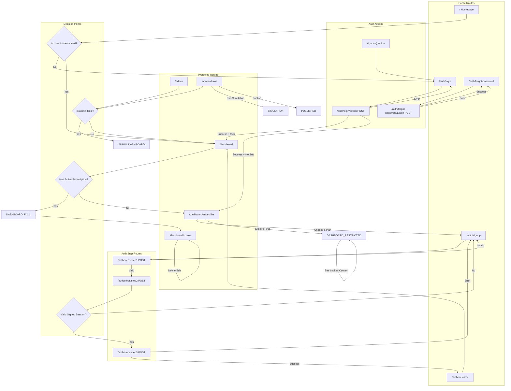
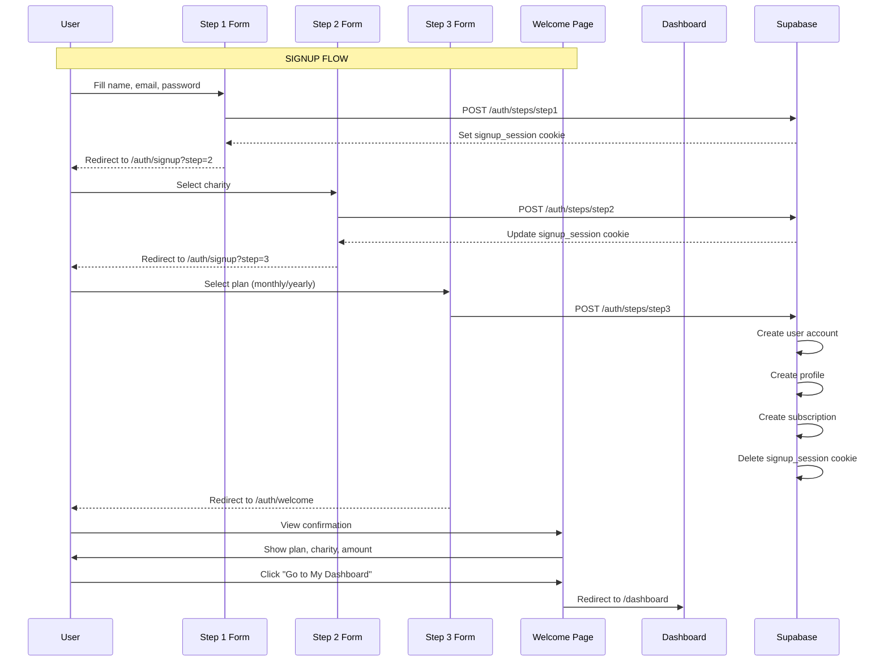
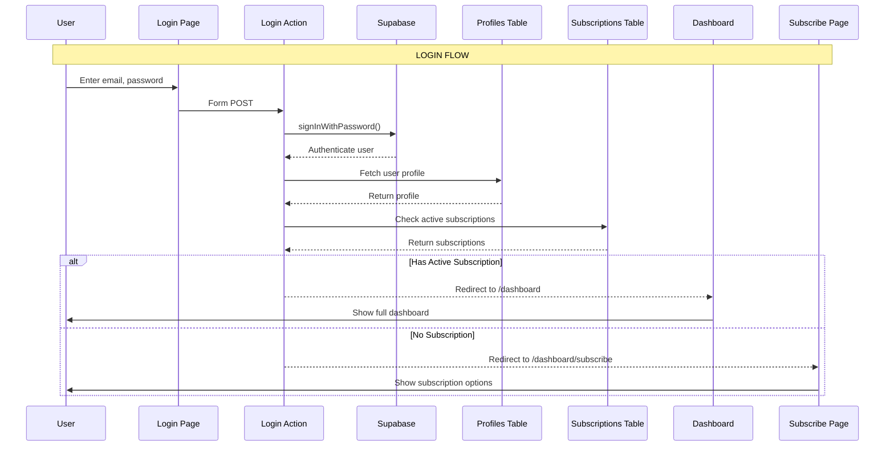
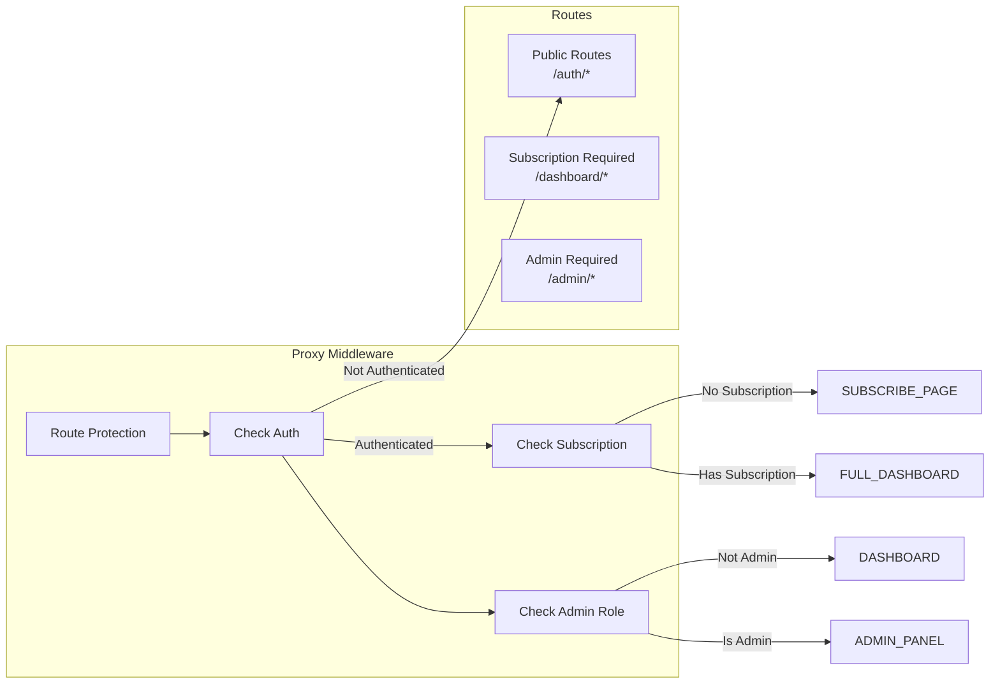
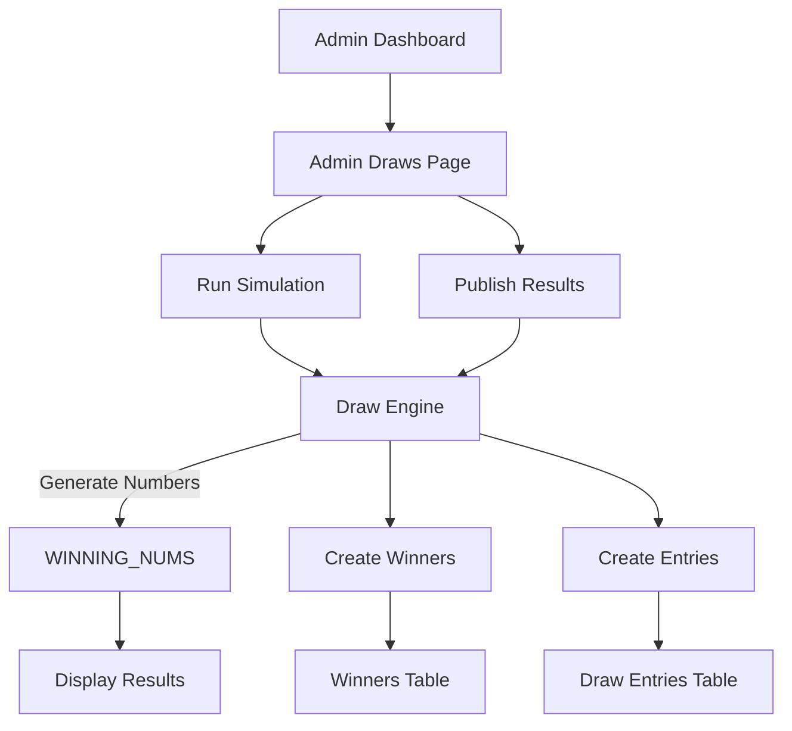

# GolfGive Platform Flow Diagram

Generated: March 2026

## Authentication & Authorization Flow



## Signup Flow (3-Step Process)



## Login Flow



## Dashboard Access Control



## Score Management Flow

```mermaid
flowchart TB
    A["Add Score Form"]
    E["Edit Score Form"]
    D["Delete Score"]
    API["/dashboard/scores/action POST"]
    DB["Supabase Scores Table"]
    UI["Score List Display"]

    A -->|"score, date"| API
    E -->|"scoreId, score, date"| API
    D -->|"scoreId, action=delete"| API
    
    API --> DB
    
    alt Add Score
        DB -->|"Check count < 5"| INSERT
        DB -->|"Count >= 5"| REPLACE_OLDEST
        REPLACE_OLDEST --> DELETE_OLDEST
        DELETE_OLDEST --> INSERT
    end

    INSERT --> UI
    UI --> A
```

## Draw System Flow



## Route Summary

| Route | Auth Required | Subscription Required | Admin Only |
|-------|---------------|---------------------|------------|
| `/` | No | No | No |
| `/auth/login` | No | No | No |
| `/auth/signup` | No | No | No |
| `/auth/forgot-password` | No | No | No |
| `/auth/welcome` | No | No | No |
| `/auth/steps/*` | No | No | No |
| `/dashboard` | Yes | Yes | No |
| `/dashboard/subscribe` | Yes | No | No |
| `/dashboard/scores` | Yes | Yes | No |
| `/admin` | Yes | No | Yes |
| `/admin/draws` | Yes | No | Yes |

## Redirect Summary

| From | To | Condition |
|------|-----|-----------|
| `/auth/*` (authenticated) | `/dashboard` | User logged in |
| `/dashboard` (no subscription) | `/dashboard/subscribe` | No active subscription |
| `/admin` (not admin) | `/dashboard` | User is not admin |
| `/dashboard/*` (not authenticated) | `/auth/login?redirect=...` | Session expired |
| After signout | `/auth/login` | Always |

## Cookie Management

| Cookie | Purpose | HttpOnly | Secure |
|---------|---------|----------|--------|
| `signup_session` | Store signup flow data between steps | Yes | Production only |
| `sb-*` | Supabase auth tokens | Yes | Production only |

## API Endpoints

| Endpoint | Method | Purpose |
|----------|--------|---------|
| `/auth/login/action` | POST | Authenticate user |
| `/auth/forgot-password/action` | POST | Send password reset email |
| `/auth/steps/step1` | POST | Save step 1 data, redirect to step 2 |
| `/auth/steps/step2` | POST | Save charity selection, redirect to step 3 |
| `/auth/steps/step3` | POST | Complete signup, create user/subscription |
| `/dashboard/scores/action` | POST | Add/Edit/Delete scores |
| `/dashboard/scores/data` | GET | Fetch user's scores |
| `/admin/draws/action` | POST | Run simulation or publish draw |
| `/admin/draws/data` | GET | Fetch draw history |

## Key Implementation Notes

1. **proxy.ts** handles all route protection middleware
2. **Route handlers** (not server actions) used for form submissions due to Turbopack caching issues
3. **signup_session** cookie stores intermediate signup data between steps
4. **Admin role check** queries profiles table, not auth metadata
5. **Restricted dashboard** shows charity info and platform overview without subscription features
